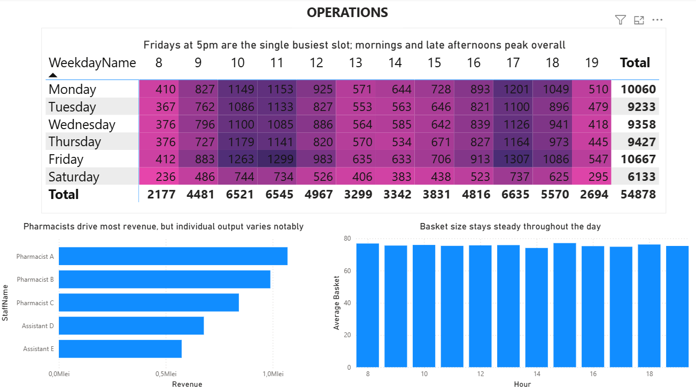
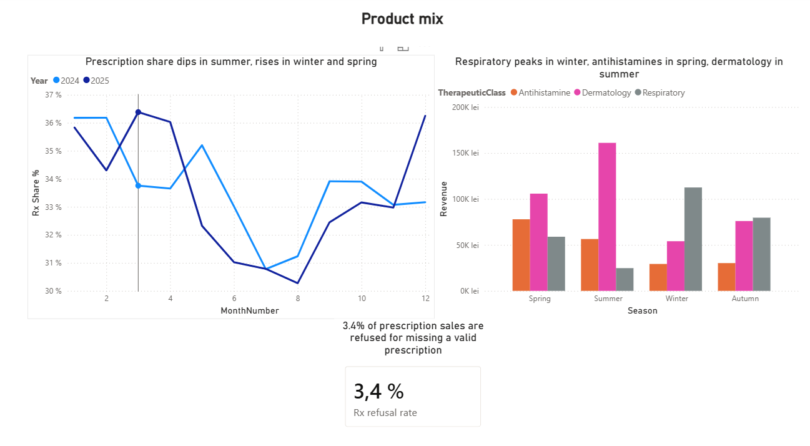
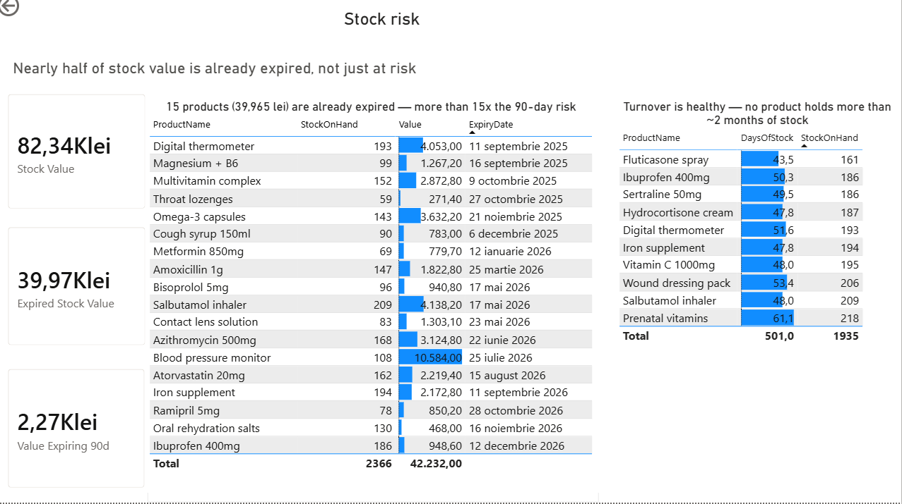

# Pharmacy Analytics Dashboard

A business analysis and reporting project built on a synthetic retail pharmacy dataset: from stakeholder requirements through to a Power BI dashboard.

> **Note on data.** All data in this repository is synthetic and generated programmatically for this project. It contains no real patients, transactions or business records.

---

## Why this project

I worked as a pharmacist for two and a half years and saw the same reporting problem repeatedly: sales sit in one system, stock in another, and answering a simple question like *"which products are about to expire and what are they worth"* means exporting both and reconciling by hand.

This project treats that as a business analysis problem first and a dashboard second. The requirements were written before anything was built.

## What is in here

| File | Contents |
|---|---|
| `REQUIREMENTS.md` | Stakeholder, business questions, user stories with acceptance criteria, glossary, assumptions |
| `/data` | Six CSV files forming a star schema |
| `/dashboard` | Power BI file and screenshots |
| `generate_data.py` | The script that produced the dataset |

## The data model

Star schema with `FactSales` at the centre.

- **FactSales** — one row per product line within a transaction, ~100,000 rows across 2024–2025
- **DimProduct** — 45 products across prescription, over-the-counter, supplement, cosmetic and medical device categories
- **DimCustomer** — 850 anonymised customers (age group, city, loyalty flag only)
- **DimDate** — full calendar with weekday and season attributes
- **DimStaff** — five staff members by role
- **Inventory** — stock on hand, reorder level and expiry date per product

## Business questions the dashboard answers

1. How is revenue trending, and which categories drive it?
2. Which categories generate margin rather than volume?
3. When are we busiest, by weekday and hour, and does staffing match?
4. How does the prescription versus over-the-counter mix shift seasonally?
5. Which stock is at risk of expiring, and what is it worth?
6. Which products are slow movers tying up capital?
7. How often are medications refused without a valid prescription?

## Status

- [x] Requirements documented
- [x] Dataset generated
- [x] Data model built in Power BI
- [x] Performance overview page
- [x] Operations page
- [x] Product mix page
- [x] Stock risk page
- [x] Findings written up

## Findings

Revenue follows a clear seasonal pattern: it declines steadily from January into a summer trough, then recovers through the final months of the year - consistent with a pharmacy's product mix leaning toward cold and flu season.

Margin tells a more nuanced story than revenue alone. Rx drives by far the most revenue, but Medical products actually carry the lowest margin of any category (even lower than Rx) while Supplement and OTC are the most profitable relative to what they sell. That gap matters more for stocking and pricing decisions than the revenue ranking on its own.

The Operations page shows clear peaks in transaction volume: Friday at 5pm is the single busiest slot of the week, with mornings (10–11am) and the 5–6pm window consistently busy across weekdays. Saturday and the opening hour (8am) are the quietest. Revenue is concentrated among pharmacists, as expected given prescription requirements, but individual output varies meaningfully even within that group. Average basket size stays flat throughout the day (74–77 lei), so there's no time-of-day pattern worth pricing around. 

The Product Mix page confirms a clear seasonal split by therapeutic class: respiratory medication peaks in winter, antihistamines in spring, and dermatology products in summer — the classic pharmacy calendar. Prescription share of revenue follows a milder version of the same pattern, dipping to ~30–31% mid-year and rising to ~36% in winter and early spring. Separately, 3.4% of prescription-required sales are refused for lacking a valid prescription. 

The Stock Risk page reveals a bigger issue than expected: nearly half of stock value (39,965 lei of 82,342 lei total) is already expired, not just at risk of expiring — more than 15x the 2,267 lei sitting in the 90-day risk window. No products are currently below reorder level. Turnover otherwise looks healthy: even the slowest-moving product holds only about 61 days of stock at current sales pace.

## Limitations & Production Considerations

This project demonstrates that the right analysis can answer the business questions a pharmacy manager cares about, it does not demonstrate a full 
production data pipeline.

- **Refresh, not automation.** The model updates correctly when new rows are added to the source files in the same format (tested manually: new FactSales rows flow through to Revenue and related visuals after a Refresh, with no changes needed elsewhere in the model). It does not, however, pull data automatically from a live till (POS) or inventory system - that integration depends on the specific systems a real pharmacy runs, and is out of scope for a project built on a static synthetic export.

- **Inventory is a snapshot, not a history**, as noted in REQUIREMENTS.md. The Stock Risk page is only as current as the last export; in production, this table would need to refresh on the same cadence as the rest of the model for the expiry figures to stay meaningful.

- **What a production version would add**: a scheduled connection (e.g. a Power BI gateway to the pharmacy's POS/ERP database) replacing manual CSV 
  exports, on a refresh cadence matched to how often the business actually needs to check these numbers - a question still to validate with the 
  stakeholder (see REQUIREMENTS.md, Non-functional requirements).

---

Built by Ana-Maria Cherecheș · [LinkedIn](https://www.linkedin.com/in/ana-maria-chereches/) · ECBA certified (IIBA)

