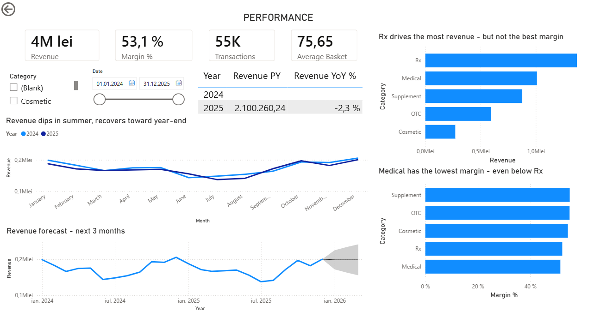

# Pharmacy Analytics Dashboard

A business analysis and reporting project built on a synthetic retail pharmacy dataset: from stakeholder requirements through to a Power BI dashboard.

> **Note on data.** All data in this repository is synthetic and generated programmatically for this project. It contains no real patients, transactions or business records.

---

## Why this project

I worked as a pharmacist for two and a half years and saw the same reporting problem repeatedly: sales sit in one system, stock in another, and answering a simple question like *"which products are about to expire and what are they worth"* means exporting both and reconciling by hand.

This project treats that as a business analysis problem first and a dashboard second. The requirements were written before anything was built.

## What is in here

| File | Contents |
|---|---|
| `REQUIREMENTS.md` | Stakeholder, business questions, user stories with acceptance criteria, glossary, assumptions |
| `/data` | Six CSV files forming a star schema |
| `/dashboard` | Power BI file and screenshots |
| `generate_data.py` | The script that produced the dataset |

## The data model

Star schema with `FactSales` at the centre.

- **FactSales** — one row per product line within a transaction, ~100,000 rows across 2024–2025
- **DimProduct** — 45 products across prescription, over-the-counter, supplement, cosmetic and medical device categories
- **DimCustomer** — 850 anonymised customers (age group, city, loyalty flag only)
- **DimDate** — full calendar with weekday and season attributes
- **DimStaff** — five staff members by role
- **Inventory** — stock on hand, reorder level and expiry date per product

## Business questions the dashboard answers

1. How is revenue trending, and which categories drive it?
2. Which categories generate margin rather than volume?
3. When are we busiest, by weekday and hour, and does staffing match?
4. How does the prescription versus over-the-counter mix shift seasonally?
5. Which stock is at risk of expiring, and what is it worth?
6. Which products are slow movers tying up capital?
7. How often are medications refused without a valid prescription?
8. What products are almost always sold together?

## Status

- [x] Requirements documented
- [x] Dataset generated
- [x] Data model built in Power BI
- [x] Performance overview page
- [ ] Operations page
- [ ] Product mix page
- [ ] Stock risk page
- [x] Findings written up

## Findings

Revenue follows a clear seasonal pattern: it declines steadily from January into a summer trough, then recovers through the final months of the year - consistent with a pharmacy's product mix leaning toward cold and flu season.

Margin tells a more nuanced story than revenue alone. Rx drives by far the most revenue, but Medical products actually carry the lowest margin of any category (even lower than Rx) while Supplement and OTC are the most profitable relative to what they sell. That gap matters more for stocking and pricing decisions than the revenue ranking on its own.

---

Built by Ana-Maria Cherecheș · [LinkedIn](https://www.linkedin.com/in/ana-maria-chereches/) · ECBA certified (IIBA)

